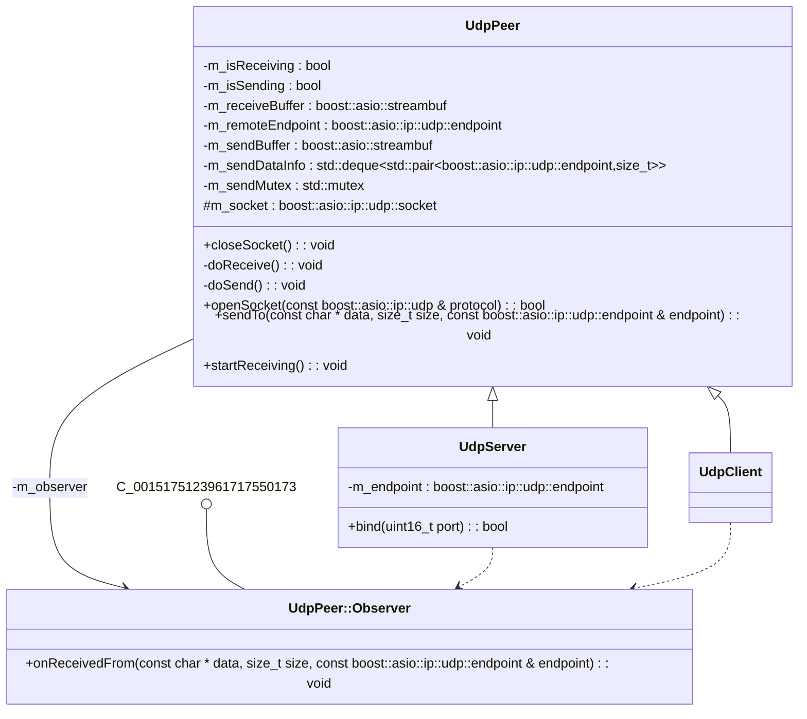

# [](https://github.com/alejandrofsevilla/boost-udp-server-client/actions/workflows/LinuxBuild.yml?event=push) [](https://github.com/alejandrofsevilla/boost-udp-server-client/actions/workflows/LinuxBuildAndTest.yml?event=push)
# Boost UDP Server/Client
Asynchronous [Boost.Asio](https://www.boost.org/doc/libs/1_74_0/doc/html/boost_asio.html) UDP Server and Client example.
## Requirements
- C++ 17
- CMake 3.22.0
- Boost 1.74.0
- GoogleTest 1.11.0
## Usage
### Server
```cpp
struct : UdpServer::Observer {
  void onReceivedFrom(const char *data, size_t size,
                      const boost::asio::ip::udp::endpoint &endpoint) {
    std::cout << "data received from endpoint address "
              << endpoint.address().to_string() << ": ";
    std::cout.write(data, size);
    std::cout << std::endl;
  };
} observer;

boost::asio::io_context context;
std::thread thread([&context]() { context.run(); });

UdpServer server{context, observer};
server.openSocket(boost::asio::ip::udp::v4());
server.bind(1234);
server.startReceiving();
```
### Client
```cpp
struct : UdpClient::Observer {
  void onReceivedFrom(const char *data, size_t size,
                      const boost::asio::ip::udp::endpoint &endpoint) {
    std::cout << "data received from endpoint address "
              << endpoint.address().to_string() << ": ";
    std::cout.write(data, size);
    std::cout << std::endl;
  };
} observer;

boost::asio::io_context context;
std::thread thread([&context]() { context.run(); });

UdpClient client{context, observer};
client.openSocket(boost::asio::ip::udp::v4());
client.startReceiving();
```
## Build
- Install dependencies.
  - linux 
   ```terminal
   sudo apt-get install libboost-dev
   sudo apt-get install libgtest-dev
   ```
  - macOs
   ```terminal
   brew install boost
   brew install googletest
   ```
- Clone repository.
   ```terminal
   git clone https://github.com/alejandrofsevilla/boost-udp-server-client.git
   cd boost-udp-server-client
   ```
- Build.
   ```terminal
   cmake -S . -B build
   cmake --build build
   ```
- Run tests.
   ```terminal
   ./build/tests/boost-udp-server-client-tests 
   ```
## Implementation

